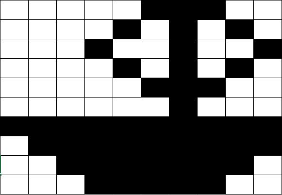

# Icon Project 

## Part A: Description

      For this project, python will transform sequences of data into a simple image. 
      
## Part B: Functionality 

      The user creates an icon on a 10x10 grid through a combination of shaded and unshaded blocks. 
      
      The blocks represent sequences of binary code, where shaded blocks are represented
      by the number 1 (on) and unshaded blocks are represented by the number 0 (off). 
      
      Python will read in 100 bits of data (i.e. the 10x10 grid) that are in a data structure, 
      likely in a dictionary format; the keys will be row numbers, which can help keep the user organized
      when entering the data; the values will be a list of numbers (e.g. {'Row 1': [1,0,0,1,1]}.
      
      To transform the data into an image, Python will print a single character (e.g. an asterik-*-)
      for every bit that is the number 1 and will print nothing for all the 0 bits. 
      
      There is no user interface; the user will hard-code in the data bits, which will be written to a file
      to be saved to memory to avoid having to re-type in the data any time the user wants to run the program. 
      The file type will be a JSON file. 
      
 ## Part C: Icon
      
      The program's creator's icon is below: 
      
    
  
      
